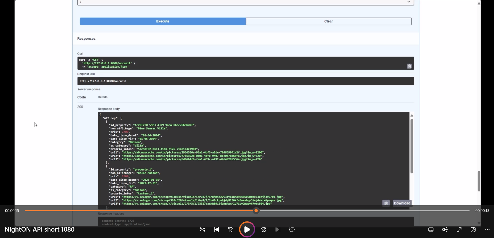

# NightON-API

#### Overview - How does it work ? 

[](./docs_projet/NightON_API_short_1080.mp4)

##### Après avoir cloné ce repos :
- Dans la racine, créez un environnement virtuel : 
```
python -m venv venv 
```
- activez l'environnement virtuel depuis la racine : 
```
venv/scripts/activate 
```
- installer les requirements depuis la racine : 
```
pip install -r requirements.txt 
```
- lancer le routeur avec : 
```
python uvicorn main:app --reload
```

NightON_API interface entre la bdd et NightON_react. <br>

##### Dernière màj : 06/03/2024

Déjà fait : <br>
  - POC : définition de la dataclass "UserClass" qui permet de faire valider les données communiquées à la bdd et qui transitent par l'API.
  - test de l'endpoint enregister_utilsateur (requête post).
  - vérification de la présence effective des données envoyées dans la base sur le localhost.
  - modélisation UML de la bdd (théorie)
  - script SQL qui crée la table userData
  - automatiser le tout dans un main.py


#### Déploiement API (à màj) : <br>
  - installer + configurer un serveur sql (mysql server ou mamp ou xamp ...)
  - créer une bdd avec les infos spécifiées dans le fichier <i>config.json</i>
  - créer la table userdata (user_id, user_email, display_user_name)
  - exécuter le UserClass.py (dans vscode)
  - <b>Résultat attendu :</b>
      * A l'exécution du main.py, l'API est disponible et écoute sur le port pré-défini par défaut
      * uvicorn envoie un lien (dans le terminal) qui permet de se connecter sur le swaggerUI (interface utilisateur) -> on peut l'utiliser ou pas en cliquant dessus
      * A partir du swaggerUI on peut tester l'API (pour moment seul la route pour creer les utilisateurs est configurée.
      * Avec le test_main.py, on peut poster des utilisateurs via une requête http, ce qui sera finalement utilisé dans le backend en react.
      * Enfin, avec une requête sql, on peut vérifier que les données ont bien été enregistrées.


#### Utilisation des routes : <br>
  
  - cf. [répertoire des routes](ressources/routes.txt) 
  - Consulter aussi ``swaggerUI`` après lancement de NightON_API pour le format des json à poster : ``.../docs`` ou ``.../redocs``


Reste à faire : <br>
  TODO